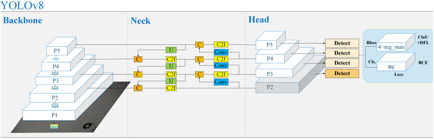
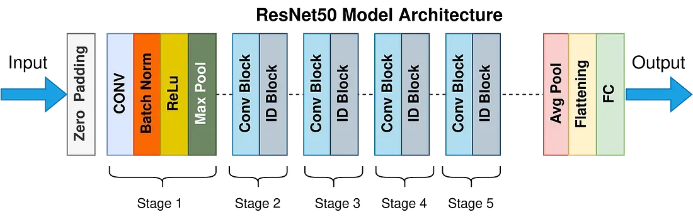
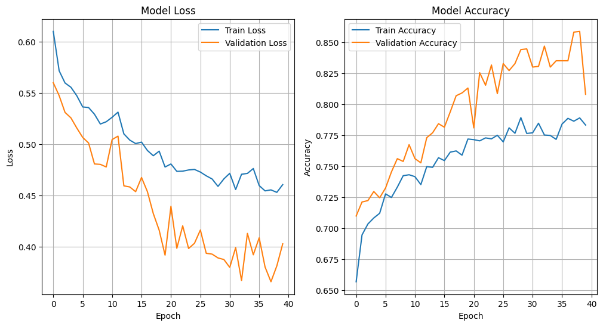
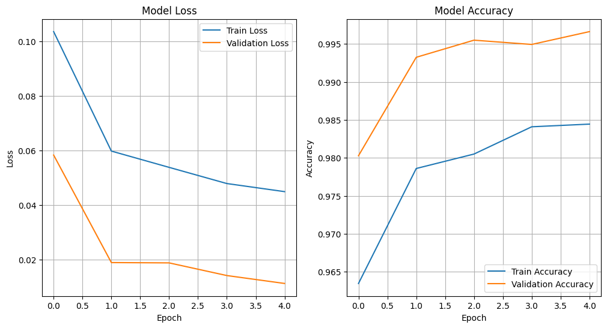
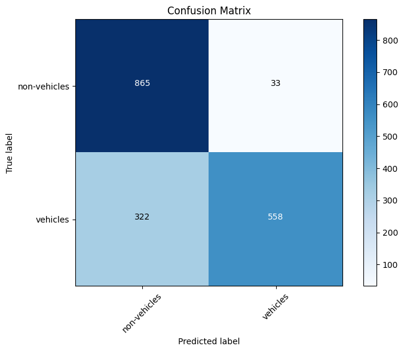
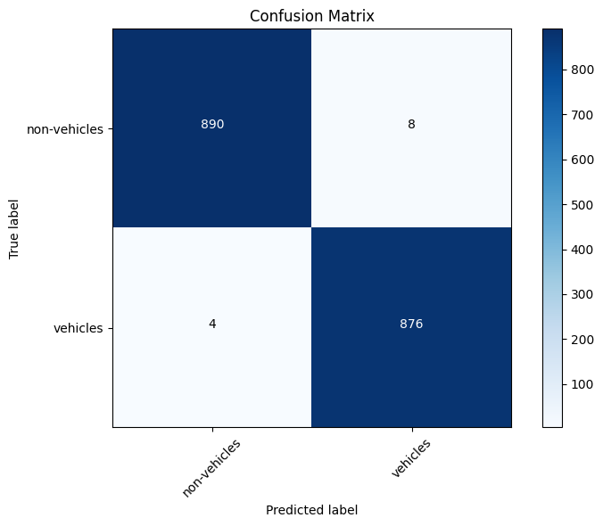

# Pendekatan Deep Learning Berbasis YOLOv8 untuk Deteksi dan Klasifikasi Mobil

## Deskripsi Proyek
Proyek ini bertujuan untuk mengembangkan sistem deteksi dan klasifikasi kendaraan menggunakan pendekatan hibrida yang memanfaatkan **YOLOv8** untuk deteksi objek dan model deep learning berbasis **ResNet50** serta **InceptionV3** untuk klasifikasi. Sistem ini bekerja dengan mendeteksi bounding box dari kendaraan secara cepat menggunakan **YOLOv8**, lalu memproses area yang terdeteksi untuk diklasifikasikan sebagai **Vehicle (Car)** atau **Non-Vehicle** dengan model klasifikasi yang telah dilatih sebelumnya. Integrasi ini diimplementasikan menggunakan framework **Streamlit**, yang memungkinkan tampilan interaktif dan efisien untuk pengguna.

---


---
## Tujuan
Tujuan proyek ini adalah memanfaatkan model **YOLOv8** dalam deteksi objek dengan **ResNet50** dan **InceptionV3** dalam klasifikasi untuk meningkatkan efisiensi deteksi dan klasifikasi kendaraan (mobil) dan diharapkan dapat memberikan solusi yang dapat diterapkan untuk berbagai kasus seperti pengawasan lalu lintas, sistem parkir pintar, atau analisis data transportasi.

---
## Dataset
Dataset yang digunakan untuk pelatihan dan pengujian model diperoleh dari Kaggle. Dataset ini terdiri dari 17.760 citra yang telah dikategorikan dalam 2 labels yaitu 8.792 *vehicle* dan 8.968 *non-vehicle*. Data dipisah dengan ratio 80% data train, 10% data val, dan 10% data test. Anda dapat mengunduh dataset melalui tautan berikut:<br>
[](https://www.kaggle.com/datasets/brsdincer/vehicle-detection-image-set/data)


---
## Instalasi
Ikuti langkah-langkah berikut untuk mengatur dan menjalankan aplikasi:

### Prasyarat
Pastikan Python sudah terinstal di sistem Anda. Disarankan menggunakan Python versi 3.11.4 atau lebih baru.

### Langkah Instalasi
1. Clone repositori:
   ```bash
   git clone <repository-link>
   cd <repository-folder>
   ```

2. Aktifkan virtual environment (virtualenv atau .venv):
   - Windows (Command Prompt):
     ```bash
     .venv\Scripts\activate
     ```
   - Windows (PowerShell):
     ```bash
     .venv\Scripts\Activate.ps1
     ```

   - Instal dependensi yang dibutuhkan:
     ```bash
     pip install streamlit
     pip install tensorflow
     pip install opencv-python
     pip install ultralytics
     ```

3. Masuk ke direktori aplikasi:
   ```bash
   cd src/code
   ```

4. Jalankan aplikasi menggunakan Streamlit:
   ```bash
   streamlit run app.py
   ```

---
# Deskripsi Model
---
# Analisis Performa
----------
# Analisis Performa YOLOv8
**YOLOv8** adalah versi terbaru dari seri model YOLO (You Only Look Once) untuk deteksi objek. YOLO merupakan arsitektur deteksi objek berbasis convolutional neural networks (CNN) yang terkenal karena kecepatan dan akurasi tinggi. Dibandingkan dengan versi sebelumnya, **YOLOv8** menawarkan peningkatan performa melalui optimasi arsitektur, keakuratan yang lebih tinggi, dan fleksibilitas dalam aplikasi.



## Cara Kerja YOLOv8
**YOLOv8**, seperti versi YOLO sebelumnya, berfungsi dengan memecah gambar input menjadi grid dan mendeteksi objek dalam setiap grid. Berikut adalah langkah-langkah utama yang dilakukan **YOLOv8**:

- **Preprocessing Input**
Gambar input pertama kali diubah ukurannya agar sesuai dengan dimensi model (biasanya persegi, seperti 640x640 piksel). Gambar ini kemudian dinormalisasi agar dapat diproses lebih efisien.

- **Feature Extraction**
YOLOv8 menggunakan arsitektur backbone yang telah dioptimalkan untuk mengekstraksi fitur dari gambar input. Fitur ini mencakup informasi penting seperti tepi, tekstur, dan pola visual lainnya. Backbone YOLOv8 didesain ringan untuk meningkatkan efisiensi komputasi.

- **Grid-based Prediction**
YOLOv8 membagi gambar menjadi grid, misalnya, ukuran 13x13 atau 52x52 (tergantung pada skala fitur). Setiap sel grid bertanggung jawab untuk mendeteksi objek jika pusat objek tersebut jatuh dalam sel tersebut. Untuk setiap sel grid, YOLOv8 memprediksi bounding box (lokasi dan ukuran) untuk objek yang terdeteksi. Bounding box direpresentasikan dalam format (x, y, w, h) di mana x dan y adalah koordinat pusat, dan w serta h adalah lebar dan tinggi. YOLOv8 juga memprediksi skor kepercayaan, yang menunjukkan seberapa yakin model bahwa ada objek di bounding box tersebut. Untuk setiap bounding box, YOLOv8 memberikan prediksi kelas (misalnya, mobil, orang, anjing, dll.) dengan menghitung probabilitas untuk setiap kategori yang mungkin. YOLOv8 menggunakan anchor box untuk membantu mendeteksi objek dengan berbagai skala dan rasio aspek. 

- **Anchor Box**
YOLOv8 menggunakan anchor box untuk membantu mendeteksi objek dengan berbagai skala dan rasio aspek. Anchor box adalah bounding box awal dengan dimensi yang telah ditentukan sebelumnya dan disesuaikan selama pelatihan agar lebih cocok dengan data.

- **Multi-Scale Detection**
YOLOv8 mendeteksi objek pada berbagai skala. Hal ini dicapai dengan menggunakan fitur dari berbagai tingkat dalam jaringan (multi-scale feature maps), sehingga YOLOv8 mampu mendeteksi objek besar maupun kecil secara efisien.

- **Non-Maximum Suppression (NMS)**
Setelah semua prediksi bounding box dan skor kelas dihitung, YOLOv8 menggunakan teknik Non-Maximum Suppression (NMS) untuk menghilangkan prediksi duplikat. NMS memastikan bahwa hanya bounding box dengan skor kepercayaan tertinggi untuk suatu objek yang dipertahankan.

- **Post-Processing**
Hasil akhir berupa bounding box, skor kepercayaan, dan label kelas ditampilkan atau digunakan untuk aplikasi lebih lanjut. Dalam kasus aplikasi seperti yang ada pada kode di atas, bounding box digambar pada gambar atau video dengan label dan warna tertentu.

## Keunggulan YOLOv8
- **Kecepatan Tinggi**: YOLOv8 sangat cepat dalam inferensi, menjadikannya cocok untuk aplikasi real-time seperti deteksi kendaraan di video atau kamera.
- **Akurasi Lebih Baik**: Dibandingkan versi sebelumnya, YOLOv8 memiliki optimasi pada arsitektur backbone dan head yang meningkatkan akurasi deteksi, terutama untuk objek kecil.
- **Efisiensi Komputasi**: YOLOv8 dirancang untuk bekerja dengan baik pada perangkat keras modern, termasuk GPU dan TPU.
- **Kemudahan Integrasi**: Dengan antarmuka API seperti yang digunakan dalam kode di atas, YOLOv8 sangat mudah diintegrasikan ke berbagai aplikasi.
Multi-tasking: YOLOv8 dapat digunakan untuk deteksi objek, segmentasi, dan bahkan deteksi pose dalam implementasi lanjutan.

## Keunggulan dan Penerapan
- **Deteksi Kendaraan (Mobil) dan Non-Kendaraan**: Digunakan untuk keamanan lalu lintas dan pengawasan.
- **Sistem Pengawasan Real-Time**: Mendukung kamera keamanan untuk mendeteksi intrusi.
- **Aplikasi Mobile dan Edge**: Efisiensinya memungkinkan penggunaan pada perangkat terbatas sumber daya.
- **Analisis Video**: Digunakan untuk menganalisis rekaman CCTV atau pemrosesan video real-time.

Dengan pendekatan berbasis grid dan optimasi dalam arsitektur, YOLOv8 adalah alat yang sangat bertenaga untuk berbagai aplikasi computer vision, seperti yang terlihat pada implementasi deteksi kendaraan di kode yang diberikan.

# Analisis Performa Model ResNet50
Model **ResNet50** adalah salah satu arsitektur deep learning yang sangat berpengaruh dan populer, terutama dalam pengenalan citra dan berbagai tugas computer vision lainnya. **ResNet50** adalah varian dari Residual Networks (ResNet), yang diperkenalkan oleh Kaiming He dan timnya, dan terkenal dengan konsep residual learning yang revolusioner. Model ini memiliki 50 lapisan dalam, menjadikannya cukup dalam namun tetap dapat dilatih dengan efisien berkat residual blocks.



## Struktur Arsitektur
Residual Blocks: Fitur utama dari **ResNet50** adalah residual blocks, yang memungkinkan aliran gradien yang lebih baik melalui jaringan yang sangat dalam. Residual blocks menggunakan mekanisme shortcut connections, di mana output dari satu lapisan dapat dilewatkan langsung ke lapisan lebih jauh, melewati beberapa lapisan tengah. Pendekatan ini membantu mencegah masalah vanishing gradients, yang sering terjadi pada model yang sangat dalam.

- **Convolutional Layers**: ResNet50 terdiri dari lapisan konvolusi yang dirancang untuk mengekstraksi fitur pada berbagai tingkat abstraksi, mulai dari fitur dasar (seperti tepi) hingga fitur kompleks (seperti pola bentuk).

- **Batch Normalization**: Untuk stabilitas pelatihan dan percepatan konvergensi, setiap lapisan konvolusi diikuti oleh batch normalization. Ini membantu menjaga distribusi aktivasi tetap konsisten selama pelatihan.

- **Pooling Layers**: ResNet50 memanfaatkan max pooling di tahap awal untuk mereduksi dimensi spasial citra, yang mengurangi beban komputasi sambil mempertahankan fitur penting.

- **Global Average Pooling (GAP)**: Di bagian akhir, ResNet50 menggunakan Global Average Pooling untuk merangkum fitur spasial menjadi representasi 1D yang digunakan untuk klasifikasi.

- **Fully Connected Layer**: ResNet50 mengakhiri arsitekturnya dengan fully connected layer untuk menghasilkan prediksi akhir berdasarkan fitur yang telah dipelajari.

## Keunggulan dan Penerapan
**ResNet50** sangat dihargai karena kemampuannya yang luar biasa dalam menangani jaringan yang dalam tanpa kehilangan performa. Beberapa aplikasi umum dari **ResNet50** antara lain:

- **Klasifikasi Citra**: ResNet50 sering digunakan dalam tugas-tugas klasifikasi citra dan dikenal mampu memberikan akurasi tinggi.
- **Deteksi Objek**: Model ini sering digunakan sebagai backbone untuk algoritma deteksi objek, seperti Faster R-CNN dan YOLO.
- **Segmentasi Citra**: Dalam segmentasi citra, ResNet50 digunakan untuk mengekstraksi fitur dari citra input.
- **Transfer Learning**: Karena arsitekturnya yang umum dan kemampuan generalisasi yang baik, ResNet50 sering digunakan sebagai model dasar dalam transfer learning untuk berbagai tugas computer vision.

## Tantangan dan Komputasi
Meskipun **ResNet50** menawarkan banyak keunggulan, ada beberapa tantangan yang perlu dipertimbangkan:

- **Kompleksitas Komputasi**: Dengan 50 lapisan, ResNet50 memerlukan sumber daya komputasi yang signifikan untuk pelatihan, terutama pada dataset besar.
- **Parameter yang Banyak**: Jumlah parameter yang besar membuat model ini rentan terhadap overfitting pada dataset kecil. Oleh karena itu, regularisasi seperti dropout atau augmentasi data sering digunakan.

## Kesimpulan
**ResNet50** adalah arsitektur deep learning yang sangat kuat dan fleksibel untuk berbagai tugas pengenalan citra. Konsep residual learning yang inovatif membuatnya mampu menangani jaringan yang dalam tanpa kehilangan performa akibat masalah vanishing gradients. Dengan kombinasi residual blocks, batch normalization, dan pooling, **ResNet50** menawarkan efisiensi dan akurasi tinggi dalam berbagai aplikasi computer vision. Namun, karena kebutuhan komputasi yang cukup besar, perhatian terhadap teknik regulasi dan optimasi sangat penting untuk memaksimalkan potensi model ini.

---
# Analisis Performa Model InceptionV3
Model **InceptionV3** adalah salah satu arsitektur deep learning yang sangat populer dan efektif dalam pengenalan citra. Model ini merupakan versi lanjutan dari keluarga arsitektur Inception, yang dikembangkan dengan fokus pada efisiensi komputasi dan kemampuan untuk mengekstraksi fitur secara mendalam dari citra.


## Struktur Arsitektur
- **Inception Modules**: InceptionV3 menggunakan pendekatan berbasis modul Inception, di mana berbagai filter konvolusi dengan ukuran berbeda (misalnya, 1x1, 3x3, 5x5) diterapkan secara paralel pada input yang sama. Ini memungkinkan model untuk menangkap fitur dengan berbagai skala dan kompleksitas tanpa memerlukan peningkatan jumlah parameter yang signifikan. Selain itu, model menggunakan teknik factorization untuk menggantikan konvolusi besar dengan konvolusi yang lebih kecil, seperti mengganti 5x5 dengan dua konvolusi 3x3 untuk mengurangi beban komputasi.

- **Batch Normalization**: Model ini secara ekstensif menggunakan batch normalization, yang membantu mempercepat proses pelatihan dan meningkatkan stabilitas model dengan mengurangi internal covariate shift.

- **Auxiliary Classifiers**: Salah satu fitur unik dari InceptionV3 adalah penggunaan auxiliary classifiers, yang merupakan kepala klasifikasi tambahan di tengah jaringan. Fitur ini bertujuan untuk mengurangi risiko overfitting dan membantu gradien untuk mengalir lebih baik ke lapisan awal selama pelatihan.

- **Global Average Pooling (GAP)**: Alih-alih menggunakan fully connected layers yang memiliki banyak parameter, InceptionV3 menggunakan Global Average Pooling di akhir jaringan untuk mereduksi dimensi fitur sebelum klasifikasi akhir. Ini mengurangi risiko overfitting dan membuat model lebih efisien secara komputasi.

## Keunggulan dan Penerapan
Model **InceptionV3** menawarkan kombinasi efisiensi dan akurasi tinggi, menjadikannya pilihan populer dalam berbagai aplikasi deep learning, seperti:

- **Klasifikasi Objek**: InceptionV3 dapat mengenali berbagai objek dalam citra dengan akurasi yang tinggi, berkat arsitektur modularnya.
- **Pengenalan Wajah**: Model ini sering digunakan dalam aplikasi pengenalan wajah yang memerlukan ektraksi fitur yang mendalam.
- **Deteksi dan Segmentasi Objek**: Dengan memanfaatkan InceptionV3 sebagai backbone, model deteksi dan segmentasi dapat memanfaatkan fitur hierarkisnya.
- **Analisis Citra Medis**: Model ini diterapkan dalam analisis citra medis untuk mendeteksi anomali atau klasifikasi penyakit berdasarkan citra medis seperti X-ray atau MRI.

## Tantangan dan Komputasi
Walaupun **InceptionV3** sangat efisien dibandingkan dengan model yang lebih dalam seperti ResNet atau VGG, model ini tetap membutuhkan sumber daya komputasi yang cukup besar untuk pelatihan. Beberapa tantangan yang sering dihadapi adalah:

- **Kompleksitas Implementasi**: Struktur modular yang kompleks membutuhkan pemahaman mendalam untuk modifikasi dan pengoptimalan.
- **Kebutuhan Data yang Besar**: Untuk mencapai performa terbaik, model ini memerlukan jumlah data pelatihan yang signifikan.

## Kesimpulan
**InceptionV3** adalah arsitektur deep learning yang sangat efisien dan kuat untuk tugas pengenalan citra. Dengan pendekatan modular dan penggunaan inovatif seperti factorization, auxiliary classifiers, dan global average pooling, model ini dapat mengekstraksi fitur dengan sangat baik tanpa memerlukan peningkatan komputasi yang besar. **InceptionV3** adalah pilihan yang sangat baik untuk aplikasi yang memerlukan keseimbangan antara akurasi tinggi dan efisiensi komputasi. Namun, perhatian terhadap sumber daya perangkat keras dan data yang tersedia sangat penting untuk mendapatkan hasil yang optimal.

## Evaluasi Performa Model
Evaluasi performa model ini dapat dilakukan dengan mengukur berbagai metrik seperti:
- **Akurasi:** Untuk melihat seberapa banyak prediksi yang benar dibandingkan dengan jumlah total prediksi.
- **Precision, Recall, dan F1-score:** Memberikan gambaran yang lebih lengkap tentang kemampuan model dalam membuat prediksi yang benar dan menghindari kesalahan seperti false positives dan false negatives.
- **Confusion Matrix:** Untuk mengidentifikasi jenis kesalahan yang sering terjadi dalam prediksi model.


---

## Hasil dan Analisis
Hasil klasifikasi dirangkum dalam tabel berikut:

*ResNet50*
| **Class**       | **Precision** | **Recall** | **F1-Score** | **Support** |
|-----------------|---------------|------------|--------------|-------------|
| **Non-Vehicle** | 0.73          | 0.96       | 0.83         |898          |
| **Vehicle**     | 0.94          | 0.63       | 0.76         |880          |
|-----------------|---------------|------------|--------------|-------------|
| **Accuracy**    |               |            | 0.80         |1778         |
| **MacroAVG**    | 0.84          | 0.80       | 0.79         |1778         |
| **MicroAVG**    | 0.84          | 0.80       | 0.79         |1778         |
----
## Analisis
Berdasarkan hasil evaluasi model yang diberikan pada tabel di atas, kita dapat melihat metrik-metrik utama seperti Precision, Recall, dan F1-Score untuk masing-masing kelas yang terkait dengan klasifikasi, yaitu **Non-Vehicle** dan **Vehicle**.

- **Non-Vehicle**: ResNet50 memiliki precision tinggi (0.73) tetapi recall lebih tinggi (0.96), yang berarti sebagian besar prediksi untuk "non-vehicle" benar. Namun, masih terdapat beberapa prediksi false positives. F1-score untuk kelas ini adalah 0.83, menunjukkan performa yang kuat untuk mendeteksi kelas "non-vehicle".

- **Vehicle**: Meskipun precision untuk kendaraan sangat tinggi (0.94), recall lebih rendah (0.63). Ini berarti banyak kendaraan yang sebenarnya tidak terdeteksi oleh model. F1-score untuk kelas ini adalah 0.76, menunjukkan performa yang moderat dalam mendeteksi "vehicle".

Secara keseluruhan, ResNet50 memiliki akurasi 80%, dengan performa lebih baik untuk kelas "non-vehicle." Namun, model ini menunjukkan kelemahan dalam mendeteksi "vehicle" secara lengkap, terlihat dari recall yang rendah pada kelas ini.

----
*InceptionV3*
| **Class**       | **Precision** | **Recall** | **F1-Score** | **Support** |
|-----------------|---------------|------------|--------------|-------------|
| **Non-Vehicle** | 1.00          | 0.99       | 0.99         |898          |
| **Vehicle**     | 0.99          | 1.00       | 0.99         |880          |
|-----------------|---------------|------------|--------------|-------------|
| **Accuracy**    |               |            | 0.99         |1778         |
| **MacroAVG**    | 0.99          | 0.99       | 0.99         |1778         |
| **MicroAVG**    | 0.99          | 0.99       | 0.99         |1778         |
----
## Analisis
Berdasarkan hasil evaluasi model pada tabel di atas, berikut adalah analisis metrik Precision, Recall, dan F1-Score untuk setiap kelas:

Berdasarkan hasil evaluasi model yang diberikan pada tabel di atas, kita dapat melihat metrik-metrik utama seperti Precision, Recall, dan F1-Score untuk masing-masing kelas yang terkait dengan klasifikasi, yaitu **Non-Vehicle** dan **Vehicle**.

- **Non-Vehicle**: Dengan precision dan recall masing-masing 1.00 dan 0.99, InceptionV3 menunjukkan performa luar biasa untuk mendeteksi "non-vehicle"
F1-score mencapai 0.99, menunjukkan model ini mampu mengidentifikasi hampir seluruh contoh kelas ini dengan sangat akurat.

- **Vehicle**: Precision dan recall juga sangat tinggi (0.99 dan 1.00), yang berarti model ini hampir tidak membuat kesalahan dalam mendeteksi kendaraan.
F1-score untuk "vehicle" adalah 0.99, menunjukkan performa sempurna dalam mendeteksi objek ini.

Model ini memiliki akurasi keseluruhan sebesar 99%, dengan performa hampir sempurna untuk kedua kelas. Ini menunjukkan kemampuan yang sangat kuat dalam mendeteksi baik "non-vehicle" maupun "vehicle."

---


## Perbandingan Performa
Secara keseluruhan, perbandingan antara model ResNet50 dan InceptionV3 menunjukkan bahwa keduanya memiliki keunggulan dan kelemahan masing-masing dalam menangani dataset ini. Model ResNet50, berdasarkan hasil evaluasi, memiliki **Accuracy** sebesar 0.80, dengan nilai **Macro Average** Precision 0.84, Recall 0.80, dan F1-Score 0.79. Sementara itu, model InceptionV3 jauh lebih unggul dengan **Accuracy** sebesar 0.99, serta **Macro Average** Precision 0.99, Recall 0.99, dan F1-Score 0.99.

### Analisis Model
- **ResNet50** memiliki kinerja yang lebih baik pada kelas non-vehicle, dengan recall yang tinggi (0.96), menunjukkan bahwa model ini sangat efektif dalam mendeteksi kelas tersebut. Namun, kelemahan utamanya terletak pada recall yang rendah (0.63) untuk kelas vehicle, yang berarti banyak kendaraan yang tidak terdeteksi. Hal ini menyebabkan model memiliki ketidakseimbangan dalam mendeteksi kedua kelas.

- **InceptionV3** menunjukkan performa hampir sempurna pada kedua kelas, dengan precision dan recall yang mendekati 1.00. Model ini mampu mendeteksi kedua kelas dengan akurasi yang sangat tinggi dan hampir tidak membuat kesalahan prediksi.

### Keunggulan dan Kelemahan
- **Keunggulan ResNet50**: Lebih ringan secara komputasi dibandingkan InceptionV3, sehingga lebih cocok untuk implementasi pada perangkat dengan sumber daya terbatas. Memiliki performa yang baik pada kelas non-vehicle, dengan recall yang sangat tinggi.

- **Kelemahan ResNet50**: Recall yang rendah untuk kelas vehicle, yang berarti banyak kendaraan tidak terdeteksi. Akurasi keseluruhan jauh lebih rendah dibandingkan dengan InceptionV3.

- **Keunggulan InceptionV3**: Akurasi sangat tinggi (99%) untuk kedua kelas, dengan metrik precision, recall, dan F1-score hampir sempurna. Mampu menangani kedua kelas dengan performa yang sangat baik tanpa bias terhadap salah satu kelas.

- **Kelemahan InceptionV3**: Membutuhkan lebih banyak sumber daya komputasi, yang bisa menjadi kendala untuk aplikasi pada perangkat keras yang terbatas.

### Kesimpulan
Dengan mempertimbangkan kinerja secara keseluruhan, InceptionV3 jauh lebih unggul dalam hal Accuracy, Precision, Recall, dan F1-Score. Model ini sangat andal untuk tugas deteksi kendaraan dan "non-vehicle," dengan performa yang hampir sempurna di semua metrik.

Namun, jika efisiensi komputasi menjadi prioritas, ResNet50 bisa menjadi pilihan, meskipun dengan trade-off pada akurasi, terutama untuk kelas vehicle. Kedua model memiliki kekuatan dan kelemahan masing-masing, tetapi InceptionV3 secara keseluruhan lebih baik untuk kebutuhan dengan persyaratan akurasi tinggi.

### Visualisasi
Berikut adalah beberapa visualisasi:
- **Grafik Akurasi dan Loss ResNet50 Model**
  
  
  
- **Grafik Akurasi dan Loss InceptionV3 Model**
  
  
  
- **Confusion Matrix ResNet50 Model**
  
  
  
- **Confusion Matrix InceptionV3 Model**
  
  
  
---

## Link Colab Models
**Model ResNet50**:<br>
[](https://colab.research.google.com/drive/1Zzu5QVQV0AO1ITZ9t7YvxIK_tSB5ZmLc?usp=sharing)

**Model InceptionV3**:<br>
[](https://colab.research.google.com/drive/1L15dvKmMNHT0ki9DWCFBZLeLJdZPPbVu?usp=sharing)

---

## Link G-Drive Models
[](https://drive.google.com/drive/folders/1VqhALCZLYAgNcFivS4T6avC-CcbaAVAK?usp=sharing)

---

## Link Demo Streamlit
Coba aplikasi langsung di sini:<br>
[](https://share.streamlit.io/)

---
## Kontribusi
Silakan fork repositori ini, ajukan isu, atau kirimkan pull request untuk berkontribusi pada proyek ini.
